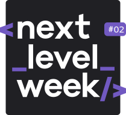
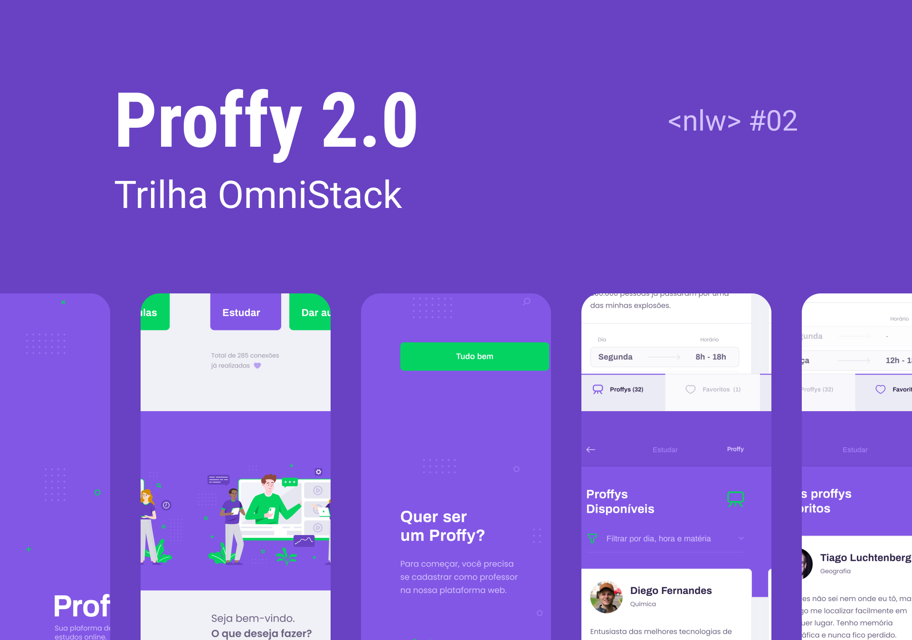

<h1 align="center">
    
</h1>

<h3 align="center">Next Level Week :rocket: </h1>

### :shrug: O que é a Next Level Week?

A semana next level foi um evento que ocorreu no dia 3 até o dia 8 de Agosto, onde desenvolvemos uma aplicação de ponta a ponta, desde o backend, frontend e mobile, usando ReactJS, React Native e NodeJS.

### :exploding_head: Qual é o objetivo do projeto?

O objetivo da NLW é acelerar a evolução do desenvolvedor, nas tecnologias Node, JavaScript e TypeScript, e ainda ter um projeto para deixar um projeto pronto no github, linkedIn ou portfólio, e lá foi apresentado os principais pilares para acelerar a evolução, foco, prática e grupo.

<h2 align="center">Proffy 👨‍🎓 </h2>

<h1 align="center">
    
</h1>

## :computer: Tecnologias

Esse projeto foi desenvolvido com as seguintes tecnologias:

- [Node.js][nodejs]
- [TypeScript][typescript]
- [React][reactjs]
- [React Native][rn]
- [Expo][expo]

[nodejs]: https://nodejs.org/
[typescript]: https://www.typescriptlang.org/
[expo]: https://expo.io/
[reactjs]: https://reactjs.org
[rn]: https://facebook.github.io/react-native/
[yarn]: https://yarnpkg.com/


## :file_folder: Como acessar o layout

O layout foi contruido usando o figma, você acessá-lo com esse link: [Projeto no Figma](https://www.figma.com/file/GHGS126t7WYjnPZdRKChJF/?viewer=1&node-id=).

## Como rodar o backend

```sh
# Entrar na pasta do projeto backend
cd server

### Instalar as depedencias
yarn ou npm i

### Rodar as migrations
yarn knex:migrate

#Rodar o projeto
yarn start

#Se você for rodar em produção
#Para gerar build da aplicação
#Vai gerar uma pasta /build
yarn build

#Rode esse comando para começar a rodar o projeto em produção
yarn start
```

## Como rodar o frontend

```sh
# Entrar na pasta do projeto backend
cd web

# Instalar as depedencias
yarn ou npm i

#Rodar o projeto
yarn start
```

## Como rodar o mobile

```sh
# Entrar na pasta do projeto backend
cd mobile

# Instalar as depedencias
yarn ou npm i

#Rodar o projeto
yarn start
```

## Autor

👤 **Kaique Araújo**

<h4 align="center">Feito com ❤️ e TypeScript.</h3>
